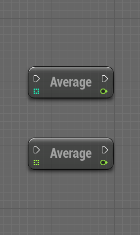
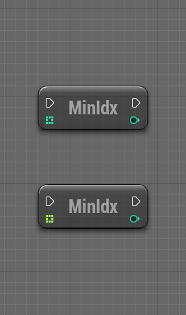
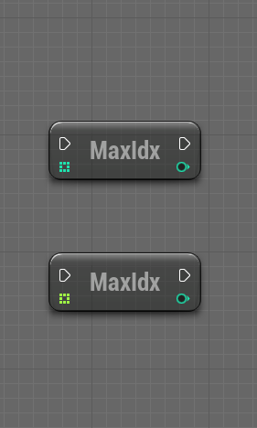
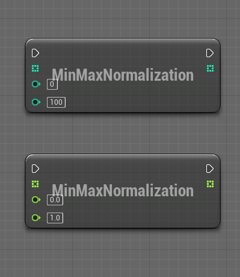

# Array Helper

 

# About

- UE plugin to handle arrays operations (sort, filter, match, range, clamp, random, average, min, max, normalize, math)
- Use custom predicate function to sort or filter arrays (Int, Float, Byte, Integer64, String, Name, Vector, Object, Actor, Generic)
- It exposes blueprint functions to handle arrays by value or by reference
- Provides some generic input nodes to operate on any array

 

# Setup

1. [Get the plugin on the marketplace](https://www.unrealengine.com/marketplace/en-US/product/array-helper-bp-library) and install the plugin for the engine version you wish to use
2. Create or open an unreal engine project with a supported version
3. In the editor, go to Edit/Plugins, search for ArrayHelper, check the box to enable the plugin, restart the editor
4. When a new plugin version is available, go to your Epic Games Launcher, under Unreal Engine/Library, under the engine version, you will find your installed plugins, find the plugin and click on update, then wait for it to finish and restart your editor

 

# Support

### Bugs/Issues

If you encounter issues with this plugin, you **should** report it, to do so, in the editor, go to Edit/Plugins, search for this plugin, click on the plugin support button, this will open your browser and navigate to the plugin issue form where you need to fill in all the relevant details about your issue, this will help me investigate and reproduce it on my own in order to fix it. Be precise and give as many details as you can. Once solved, a new plugin version will be submitted to the marketplace, update the plugin and you are good to go. **Due to epic marketplace limitations, I can only patch/update this plugin for the last 3 engine version, older engine versions will not be supported anymore.**

### Feature requests

If you want a new feature relevant to this plugin use case, you can submit a request in the [plugin marketplace question page](https://www.unrealengine.com/marketplace/en-US/product/array-helper-bp-library/questions). I **may** add this new feature in a future plugin version.

 

# Documentation

    Screenshots may differ from the latest plugin version, some features may have evolved or have been removed if deprecated.

    In UE 5.1, the plugin files were renamed from "SortPlugin" to "ArrayHelper" to match the real name of the plugin, you can remove the plugin and reinstall it if you want a clean install, check your uproject file to change the plugin name there too, the plugin nodes names have not changed, this renaming was necessary to match with the plugin name.

    If you wish to update the current array, use functions with "ref" for best performance.

    If you wish to keep the current array and get another array as output, use standard function without "ref" (a copy of the array will be made).

### Average

    Computes the average of an array

| Node | Inputs | Outputs | Note |
| ---- | ------ | ------- | ---- |
| AverageInteger | Array(Integer) | Average(Float) |  |
| AverageFloat | Array(Float) | Average(Float) |  |
| AverageDouble | Array(Double) | Average(Float) |  |
| AverageByte | Array(Byte) | Average(Float) |  |
| AverageInteger64 | Array(Integer64) | Average(Float) |  |

 

### Minimum

    Returns the index of the minimum value in the array or -1

| Node | Inputs | Outputs | Note |
| ---- | ------ | ------- | ---- |
| MinimumIntegerIndex | Array(Integer) | Index(Integer) |  |
| MinimumFloatIndex | Array(Float) | Index(Integer) |  |
| MinimumDoubleIndex | Array(Double) | Index(Integer) |  |
| MinimumByteIndex | Array(Byte) | Index(Integer) |  |
| MinimumInteger64Index | Array(Integer64) | Index(Integer) |  |

 

### Maximum

    Returns the index of the maximum value in the array or -1

| Node | Inputs | Outputs | Note |
| ---- | ------ | ------- | ---- |
| MaximumIntegerIndex | Array(Integer) | Index(Integer) |  |
| MaximumFloatIndex | Array(Float) | Index(Integer) |  |
| MaximumDoubleIndex | Array(Double) | Index(Integer) |  |
| MaximumByteIndex | Array(Byte) | Index(Integer) |  |
| MaximumInteger64Index | Array(Integer64) | Index(Integer) |  |

 

### Normalization

    Normalize the value of the array between min and max

| Node | Inputs | Outputs | Note |
| ---- | ------ | ------- | ---- |
| MinMaxIntegerNormalization | Array(Integer), Min(Integer), Max(Integer) | Array(Integer) |  |
| MinMaxFloatNormalization | Array(Float), Min(Float), Max(Float) | Array(Float) |  |
| MinMaxDoubleNormalization | Array(Double), Min(Double), Max(Double) | Array(Double) |  |
| MinMaxByteNormalization | Array(Byte), Min(Byte), Max(Byte) | Array(Byte) |  |
| MinMaxInteger64Normalization | Array(Integer64), Min(Integer64), Max(Integer64) | Array(Integer64) |  |

 

### Reverse

    Reverse a generic array by copy and return the reversed array

| Node | Inputs | Outputs | Note |
| ---- | -------| ------- | ---- |
| ReverseArray | Array(*) | Array(*) |  |

 

### Convert

| Node | Inputs | Outputs | Note |
| ---- | ------ | ------- | ---- |
| ToSet | Array(*) | Set(*) | Converts a generic array to a new set and removes duplicates |
| MakeTransformArray | Locations(Array(Vector)), Rotations(Array(Rotator)), Scales(Array(Vector)) | Result(Bool), Transforms(Array(Transform)) | Creates a transform array out of locations, rotations, scales arrays |
| BreakTransformArray | Transforms(Array(Transform)) | Locations(Array(Vector)), Rotations(Array(Rotator)), Scales(Array(Vector)) | Creates locations, rotations, scales arrays out of a transform array |
| SplitString | String(String), Separator(String), SearchCase(Enum), RemoveEmptyString(Bool) | Array(String) | Splits a string using a specific separator and return an array of strings |
| ArrayToString | Array(*), Delimiter(String), Start(String), End(String), ShowIndexes(Bool) | String(String) | Converts a generic array into a string |
  
 

### Clamp

    Creates or updates an array clamped using min and max value
 
| Node | Inputs | Outputs | Note |
| ---- | ------ | ------- | ---- |
| ClampInteger | Array(Integer), Min, Max | Array(Integer) |  |
| ClampFloat | Array(Float), Min, Max | Array(Float) |  |
| ClampDouble | Array(Double), Min, Max | Array(Double) |  |
| ClampByte | Array(Byte), Min, Max | Array(Byte) |  |
| ClampInteger64 | Array(Integer64), Min, Max | Array(Integer64) |  |
| ClampVectorSize | Array(Vector), MinSize(Float), MaxSize(Float), Only2D(Bool) | Array(Vector) |  |
| ClampVector2DSize | Array(Vector2D), MinSize(Float), MaxSize(Float) | Array(Vector2D) |  |
| ClampIntegerByRef | Array(Integer), Min, Max | void |  |
| ClampFloatByRef | Array(Float), Min, Max | void |  |
| ClampDoubleByRef | Array(Double), Min, Max | void |  |
| ClampByteByRef | Array(Byte), Min, Max | void |  |
| ClampInteger64ByRef | Array(Integer64), Min, Max | void |  |
| ClampVectorSizeRef | Array(Vector), MinSize, MaxSize, Only2D | void |  |
| ClampVector2DSizeRef | Array(Vector2D), MinSize, MaxSize | void |  |

 

### Range

 
| Node | Inputs | Outputs | Note |
| ---- | ------ | ------- | ---- |
| ExtractArray | Array(*), StartIndex, EndIndex | Array(*) | Creates a subarray out of a generic array using start and end index |

 

### Random

 
| Node | Inputs | Outputs | Note |
| ---- | ------ | ------- | ---- |
| RandomInteger | Size, Min, Max | Array(Integer) | Returns a random array filled with value between min and max |
| RandomFloat | Size, Min, Max | Array(Float) | Returns a random array filled with value between min and max |
| RandomDouble | Size, Min, Max | Array(Double) | Returns a random array filled with value between min and max |
| RandomVector | Size, Min, Max | Array(Vector) | Returns a random array filled with value between min and max |
| RandomVector2D | Size, Min, Max | Array(Vector2D) | Returns a random array filled with value between min and max |
| RandomByte | Size, Min, Max | Array(Byte) | Returns a random array filled with value between min and max |
| RandomBoolean | Size | Array(Boolean) | Returns a random array filled with value |
| RandomInteger64 | Size, Min, Max | Array(Integer64) | Returns a random array filled with value between min and max |
| PickRandomItem | Array(*), Weights(Int) | Item(*), Index(Int) | Picks a random item in a generic array based on weights and returns it with its index |

 

### Sort

 
| Node | Inputs | Outputs | Note |
| ---- | ------ | ------- | ---- |
| SortInteger | Array(Integer), IsAscending | Array(Integer) | Returns a copy of the array sorted by descending or ascending order |
| SortFloat | Array(Float), IsAscending | Array(Float) | Returns a copy of the array sorted by descending or ascending order |
| SortDouble | Array(Double), IsAscending | Array(Double) | Returns a copy of the array sorted by descending or ascending order |
| SortByte | Array(Byte), IsAscending | Array(Byte) | Returns a copy of the array sorted by descending or ascending order |
| SortInteger64 | Array(Integer64), IsAscending | Array(Integer64) | Returns a copy of the array sorted by descending or ascending order |
| SortString | Array(String), IsAscending | Array(String) | Returns a copy of the array sorted by descending or ascending order |
| SortName | Array(Name), IsAscending | Array(Name) | Returns a copy of the array sorted by descending or ascending order |
| SortActor | Array(Actor), Origin(Actor), isAscending | Array(Actor) | Returns a copy of the array sorted by descending or ascending order based on distance to origin |
| SortVector | Array(Vector), Origin(Vector), IsAscending | Array(Vector) | Returns a copy of the array sorted by descending or ascending order based on Origin |
| SortVector2D | Array(Vector2D), Origin(Vector2D), IsAscending | Array(Vector2D) | Returns a copy of the array sorted by descending or ascending order based on Origin |
| SortVertices | Array(Vector2D), CounterClockWise(Bool) | Array(Vectir2D) | Returns a copy of the vertices array sorted by (counter) clock wise order |
| SortIntegerByRef | Array(Integer), IsAscending | void | Sorts the input array by descending or ascending order |
| SortFloatByRef | Array(Float), IsAscending | void | Sorts the input array by descending or ascending order |
| SortDoubleByRef | Array(Double), IsAscending | void | Sorts the input array by descending or ascending order |
| SortByteByRef | Array(Byte), IsAscending | void | Sorts the input array by descending or ascending order |
| SortInteger64ByRef | Array(Integer64), IsAscending | void | Sorts the input array by descending or ascending order |
| SortStringByRef | Array(String), IsAscending | void | Sorts the input array by descending or ascending order |
| SortNameByRef | Array(Name), IsAscending | void | Sorts the input array by descending or ascending order |
| SortActorByRef | Array(Actor), Origin(Actor), IsAscending | void | Sorts the input array by descending or ascending order based on distance to origin |
| SortVectorByRef | Array(Vector), Origin, IsAscending | void | Sorts the input array by descending or ascending order based on Origin |
| SortVector2DByRef | Array(Vector2D), Origin, IsAscending | void | Sorts the input array by descending or ascending order based on Origin |
| SortVerticesByRef | Array(Vector2D), CounterClockWise(Bool) | void | Sorts the input array by (counter) clock wise order |

 

### Sort by predicate

 
    Note v2: In order to sort by predicate you must create a functions by dragging the PredicateFunction pin and select create event, then create or select a matching function in the list

    Note v1.1 and minor: In order to sort by predicate you must implement the ArrayComparator Interface and pass the object implementing this interface as input of the function (Context), the appropriate compare method will be called to perform the sort

 
| Node | Inputs | Outputs | Note |
| ---- | ------ | ------- | ---- |
| PredicateSortInteger | Array(Integer), PredicateFunction, InvertResult | Array(Integer) | Returns a new array sorted using a custom predicate |
| PredicateSortFloat | Array(Float), PredicateFunction, InvertResult | Array(Float) | Returns a new array sorted using a custom predicate |
| PredicateSortDouble | Array(Double), PredicateFunction, InvertResult | Array(Double) | Returns a new array sorted using a custom predicate |
| PredicateSortByte | Array(Byte), PredicateFunction, InvertResult | Array(Byte) | Returns a new array sorted using a custom predicate |
| PredicateSortInteger64 | Array(Integer64), PredicateFunction, InvertResult | Array(Integer64) | Returns a new array sorted using a custom predicate |
| PredicateSortString | Array(String), PredicateFunction, InvertResult | Array(String) | Returns a new array sorted using a custom predicate |
| PredicateSortName | Array(Name), PredicateFunction, InvertResult | Array(Name) | Returns a new array sorted using a custom predicate |
| PredicateSortVector | Array(Vector),PredicateFunction, InvertResult | Array(Vector) | Returns a new array sorted using a custom predicate |
| PredicateSortVector2D | Array(Vector2D),PredicateFunction, InvertResult | Array(Vector2D) | Returns a new array sorted using a custom predicate |
| PredicateSortActor | Array(Actor), PredicateFunction, InvertResult | Array(Actor) | Returns a new array sorted using a custom predicate |
| PredicateSortObject | Array(Object), PredicateFunction, InvertResult | Array(Object) | Returns a new array sorted using a custom predicate |
| PredicateSortIntegerByRef | Array(Integer), PredicateFunction, InvertResult | void | Sorts the input array using a custom predicate |
| PredicateSortFloatByRef | Array(Float), PredicateFunction, InvertResult | void | Sorts the input array using a custom predicate |
| PredicateSortDoubleByRef | Array(Double), PredicateFunction, InvertResult | void | Sorts the input array using a custom predicate |
| PredicateSortByteByRef | Array(Byte), PredicateFunction, InvertResult | void | Sorts the input array using a custom predicate |
| PredicateSortInteger64ByRef | Array(Integer64), PredicateFunction, InvertResult | void | Sorts the input array using a custom predicate |
| PredicateSortStringByRef | Array(String), PredicateFunction, InvertResult | void | Sorts the input array using a custom predicate |
| PredicateSortNameByRef | Array(Name), PredicateFunction, InvertResult | void | Sorts the input array using a custom predicate |
| PredicateSortVectorByRef | Array(Vector), PredicateFunction, InvertResult | void | Sorts the input array using a custom predicate |
| PredicateSortVector2DByRef | Array(Vector2D), PredicateFunction, InvertResult | void | Sorts the input array using a custom predicate |
| PredicateSortActorByRef | Array(Actor), PredicateFunction, InvertResult | void | Sorts the input array using a custom predicate |
| PredicateSortObjectByRef | Array(Object), PredicateFunction, InvertResult | void | Sorts the input array using a custom predicate |

 

### Distance

 
| Node | Inputs | Outputs | Note |
| ---- | ------ | ------- | ---- |
| ClosestLocation | Array(Vector), Origin(Vector) | Closest(Vector), Distance, Index | Return the closest vector to Origin, the distance, the index in array |
| FarthestLocation | Array(Vector), Origin(Vector) | Farthest(Vector), Distance, Index | Return the farthest vector to Origin, the distance, the index in array |
| ClosestActor | Array(Actor), Origin(Actor) | Closest(Actor), Distance, Index | Return the closest actor to Origin, the distance, the index in array |
| FarthestActor | Array(Actor), Origin(Actor) | Farthest(Actor), Distance, Index | Return the farthest actor to Origin, the distance, the index in array |
| ClosestTransform | Array(Transform), Origin(Vector) | Closest(Transform), Distance, Index | Return the closest transform to Origin, the distance, the index in array |
| FarthestTransform | Array(Transform), Origin(Vector) | Farthest(Transform), Distance, Index | Return the farthest transform to Origin, the distance, the index in array |

 

### Filters

| Node | Inputs | Outputs | Note |
| ---- | ------ | ------- | ---- |
| FilterMatches | Array(String), Pattern | Found, Array(String) | Returns an array containing strings that match the pattern (regex) |
| FilterMatch | Array(String), Pattern | Found, String, Index | Returns the first string matching the pattern (regex) with its index |

 

### Filters by predicate

    Note v2: In order to filter by predicate you must create a functions by dragging the PredicateFunction pin and select create event, then create or select a matching function in the list

    Note v1.1 and minor : In order to filter by predicate you must implement the ArrayFilter Interface and pass the object implementing this interface as input of the function (Context), the appropriate filter method will be called to perform the filtering

| Node | Inputs | Outputs | Note |
| ---- | ------ | ------- | ---- |
| PredicateFilterInteger | Array(Integer), PredicateFunction, InvertResult | Array(Integer) | Returns a new array filtered using a custom predicate |
| PredicateFilterFloat | Array(Float), PredicateFunction, InvertResult | Array(Float) | Returns a new array filtered using a custom predicate |
| PredicateFilterDouble | Array(Double), PredicateFunction, InvertResult | Array(Double) | Returns a new array filtered using a custom predicate |
| PredicateFilterByte | Array(Byte), PredicateFunction, InvertResult | Array(Byte) | Returns a new array filtered using a custom predicate |
| PredicateFilterInteger64 | Array(Integer64), PredicateFunction, InvertResult | Array(Integer64) | Returns a new array filtered using a custom predicate |
| PredicateFilterString | Array(String), PredicateFunction, InvertResult | Array(String) | Returns a new array filtered using a custom predicate |
| PredicateFilterName | Array(Name), PredicateFunction, InvertResult | Array(Name) | Returns a new array filtered using a custom predicate |
| PredicateFilterVector | Array(Vector), PredicateFunction | Array(Vector) | Returns a new array filtered using a custom predicate, InvertResult |
| PredicateFilterVector2D | Array(Vector2D), PredicateFunction | Array(Vector2D) | Returns a new array filtered using a custom predicate, InvertResult |
| PredicateFilterActor | Array(Actor), PredicateFunction | Array(Actor) | Returns a new array filtered using a custom predicate, InvertResult |
| PredicateFilterObject | Array(Object), PredicateFunction | Array(Object) | Returns a new array filtered using a custom predicate, InvertResult |

 

### Math

    Perform math operations on a generic numeric array

| Node | Inputs | Outputs | Note |
| ---- | ------ | ------- | ---- |
| + | Array(Numeric), Numeric | Result(Bool) | Performs a add operation on all numeric elements in the generic numeric array |
| - | Array(Numeric), Numeric | Result(Bool) | Performs a subtract operation on all numeric elements in the generic numeric array |
| * | Array(Numeric), Numeric | Result(Bool) | Performs a multiply operation on all numeric elements in the generic numeric array |
| / | Array(Numeric), Numeric | Result(Bool) | Performs a division operation on all numeric elements in the generic numeric array |
