# ArrayHelper

- UE4 Plugin to handle arrays operations (sort, filter, match, range, clamp, random)
- Use custom predicate function to sort or filter arrays (Int, Float, String, Name, Vector, Object, Actor)
- This is a blueprint library plugin
- It exposes 60+ functions to handle arrays by value or by reference
- Can be used in any blueprint

 

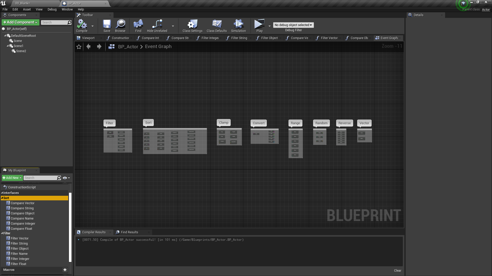

[Link to the plugin in marketplace](https://www.unrealengine.com/marketplace/en-US/product/array-helper-bp-library)

 

# Documentation

 

# Reverse (by copy)

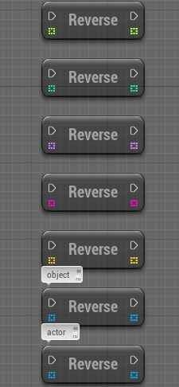

| Node | Inputs | Outputs | Note |
| -------- | ---- | ---- | ---- |
| ReverseInteger | Array(Integer) | Array(Integer) | Reverse an array by copy and return the reversed array |
| ReverseFloat | Array(Float) | Array(Float) | Reverse an array by copy and return the reversed array |
| ReverseString | Array(String) | Array(String) | Reverse an array by copy and return the reversed array |
| ReverseName | Array(Name) | Array(Name) | Reverse an array by copy and return the reversed array |
| ReverseVector | Array(Vector) | Array(Vector) | Reverse an array by copy and return the reversed array |
| ReverseObject | Array(Object) | Array(Object) | Reverse an array by copy and return the reversed array |
| ReverseActor | Array(Actor) | Array(Actor) | Reverse an array by copy and return the reversed array |

 

# Convert

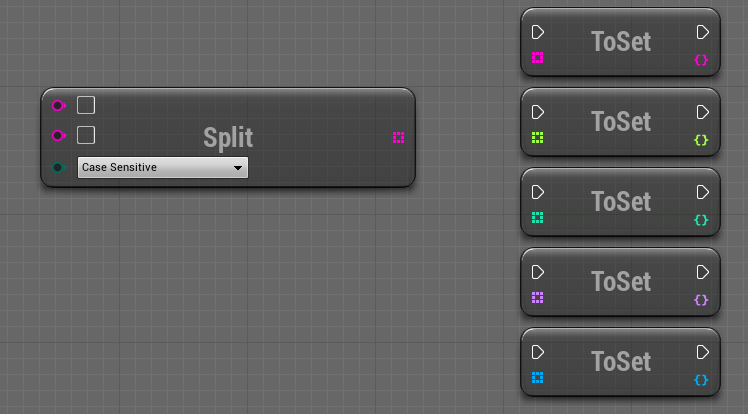

| Node | Inputs | Outputs | Note |
| -------- | ---- | ---- | ---- |
| SplitString | String | Array(String) | Splits a string using a specific separator and return an array of strings |
| ToIntegerSet | Array(Integer) | Set(Integer) | Converts an array to a new set (removes duplicate) |
| ToFloatSet | Array(Float) | Set(Float) | Converts an array to a new set (removes duplicate) |
| ToNameSet | Array(Name) | Set(Name) | Converts an array to a new set (removes duplicate) |
| ToStringSet | Array(String) | Set(String) | Converts an array to a new set (removes duplicate) |
| ToVectorSet | Array(Vector) | Set(Vector) | Converts an array to a new set (removes duplicate) |
| ToObjectSet | Array(Object) | Set(Object) | Converts an array to a new set (removes duplicate) |
| ToActorSet | Array(Actor) | Set(Actor) | Converts an array to a new set (removes duplicate) |
  
 

# Clamp

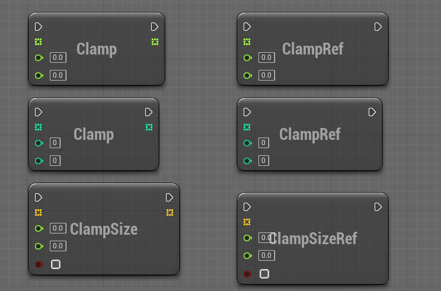
 
| Node | Inputs | Outputs | Note |
| -------- | ---- | ---- | ---- |
| ClampInteger | Array(Integer), Min, Max | Array(Integer) | Returns a new array clamped using min and max value |
| ClampFloat | Array(Float), Min, Max | Array(Float) | Returns a new array clamped using min and max value |
| ClampVector | Array(Vector), MinSize, MaxSize, Only2D | Array(Vector) | Returns a new array clamped using min and max value |
| ClampIntegerByRef | Array(Integer), Min, Max | void | Updates the input array and clamp values using min and max value |
| ClampFloatByRef | Array(Float), Min, Max | void | Updates the input array and clamp values using min and max value |
| ClampVectorRef | Array(Vector), MinSize, MaxSize, Only2D | void | Updates the input array and clamp values using min and max value |

 

# Range

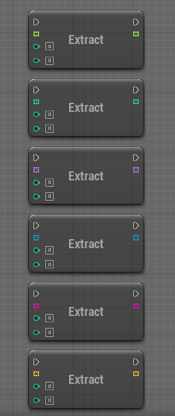
 
| Node | Inputs | Outputs | Note |
| -------- | ---- | ---- | ---- |
| ExtractInteger | Array(Integer), StartIndex, EndIndex | Array(Integer) | Returns a subarray of the first array using start and end index |
| ExtractFloat | Array(Float), StartIndex, EndIndex | Array(Float) | Returns a subarray of the first array using start and end index |
| ExtractString | Array(String), StartIndex, EndIndex | Array(String) | Returns a subarray of the first array using start and end index |
| ExtractName | Array(Name), StartIndex, EndIndex | Array(Name) | Returns a subarray of the first array using start and end index |
| ExtractVector | Array(Vector), StartIndex, EndIndex | Array(Vector) | Returns a subarray of the first array using start and end index |
| ExtractObject | Array(Object), StartIndex, EndIndex | Array(Object) | Returns a subarray of the first array using start and end index |
| ExtractActor | Array(Actor), StartIndex, EndIndex | Array(Actor) | Returns a subarray of the first array using start and end index |

 

# Random

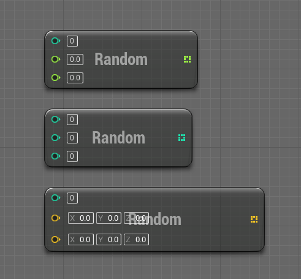
 
| Node | Inputs | Outputs | Note |
| -------- | ---- | ---- | ---- |
| RandomInteger | Size, Min, Max | Array(Integer) | Returns a random array filled with value between min and max |
| RandomFloat | Size, Min, Max | Array(Float) | Returns a random array filled with value between min and max |
| RandomVector | Size, Min, Max | Array(Vector) | Returns a random array filled with value between min and max |

 

# Sort

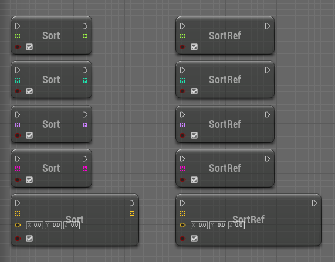
 
| Node | Inputs | Outputs | Note |
| -------- | ---- | ---- | ---- |
| SortInteger | Array(Integer), IsAscending | Array(Integer) | Returns a copy of the array sorted by descending or ascending order |
| SortFloat | Array(Float), IsAscending | Array(Float) | Returns a copy of the array sorted by descending or ascending order |
| SortString | Array(String), IsAscending | Array(String) | Returns a copy of the array sorted by descending or ascending order |
| SortName | Array(Name), IsAscending | Array(Name) | Returns a copy of the array sorted by descending or ascending order |
| SortVector | Array(Vector), Origin(Vector), IsAscending | Array(Vector) | Returns a copy of the array sorted by descending or ascending order based on Origin |
| SortActor | Array(Actor), Origin(Actor), isAscending | Array(Actor) | Returns a copy of the array sorted by descending or ascending order based on distance to origin |
| SortIntegerByRef | Array(Integer), IsAscending | void | Sorts the input array by descending or ascending order |
| SortFloatByRef | Array(Float), IsAscending | void | Sorts the input array by descending or ascending order |
| SortStringByRef | Array(String), IsAscending | void | Sorts the input array by descending or ascending order |
| SortNameByRef | Array(Name), IsAscending | void | Sorts the input array by descending or ascending order |
| SortVectorByRef | Array(Vector), Origin, IsAscending | void | Sorts the input array by descending or ascending order based on Origin |
| SortActorByRef | Array(Actor), Origin(Actor), IsAscending | void | Sorts the input array by descending or ascending order based on distance to origin |

 

# Sort by predicate

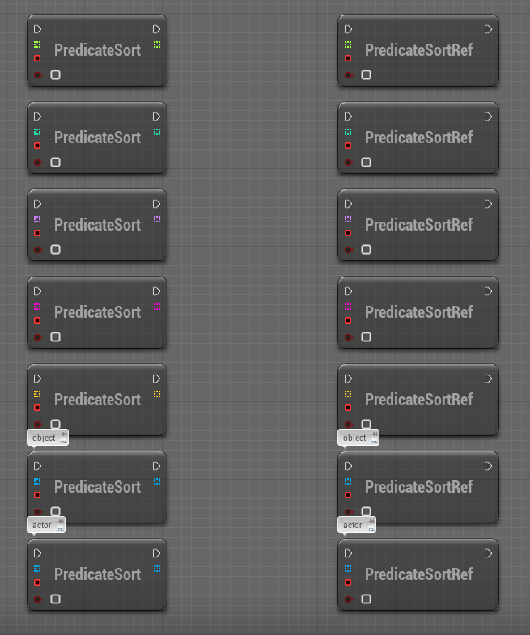
 
    Note v2: In order to sort by predicate you must create a functions by dragging the PredicateFunction pin and select create event, then create or select a matching function in the list

    Note v1.1 and minor: In order to sort by predicate you must implement the ArrayComparator Interface and pass the object implementing this interface as input of the function (Context), the appropriate compare method will be called to perform the sort

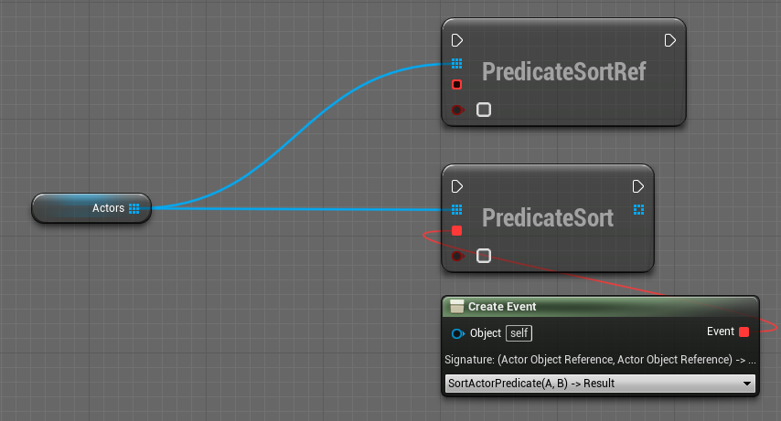
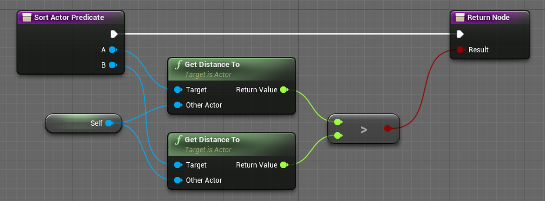
 
| Node | Inputs | Outputs | Note |
| -------- | ---- | ---- | ---- |
| PredicateSortInteger | Array(Integer), PredicateFunction, InvertResult | Array(Integer) | Returns a new array sorted using a custom predicate |
| PredicateSortFloat | Array(Float), PredicateFunction, InvertResult | Array(Float) | Returns a new array sorted using a custom predicate |
| PredicateSortString | Array(String), PredicateFunction, InvertResult | Array(String) | Returns a new array sorted using a custom predicate |
| PredicateSortName | Array(Name), PredicateFunction, InvertResult | Array(Name) | Returns a new array sorted using a custom predicate |
| PredicateSortVector | Array(Vector),PredicateFunction, InvertResult | Array(Vector) | Returns a new array sorted using a custom predicate |
| PredicateSortObject | Array(Object), PredicateFunction, InvertResult | Array(Object) | Returns a new array sorted using a custom predicate |
| PredicateSortActor | Array(Actor), PredicateFunction, InvertResult | Array(Actor) | Returns a new array sorted using a custom predicate |
| PredicateSortIntegerByRef | Array(Integer), PredicateFunction, InvertResult | void | Sorts the input array using a custom predicate |
| PredicateSortFloatByRef | Array(Float), PredicateFunction, InvertResult | void | Sorts the input array using a custom predicate |
| PredicateSortStringByRef | Array(String), PredicateFunction, InvertResult | void | Sorts the input array using a custom predicate |
| PredicateSortNameByRef | Array(Name), PredicateFunction, InvertResult | void | Sorts the input array using a custom predicate |
| PredicateSortVectorByRef | Array(Vector), PredicateFunction, InvertResult | void | Sorts the input array using a custom predicate |
| PredicateSortObjectByRef | Array(Object), PredicateFunction, InvertResult | void | Sorts the input array using a custom predicate |
| PredicateSortActorByRef | Array(Actor), PredicateFunction, InvertResult | void | Sorts the input array using a custom predicate |

 

# Distance

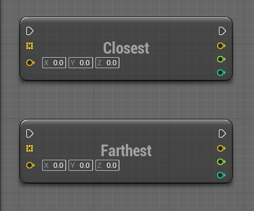
 
| Node | Inputs | Outputs | Note |
| -------- | ---- | ---- | ---- |
| ClosestLocation | Array(Vector), Origin(Vector) | Closest(Vector), Distance, Index | Return the closest vector to Origin, the distance, the index in array |
| FarthestLocation | Array(Vector), Origin(Vector) | Farthest(Vector), Distance, Index | Return the farthest vector to Origin, the distance, the index in array |
| ClosestActor | Array(Actor), Origin(Actor) | Closest(Actor), Distance, Index | Return the closest actor to Origin, the distance, the index in array |
| FarthestActor | Array(Actor), Origin(Actor) | Farthest(Actor), Distance, Index | Return the farthest actor to Origin, the distance, the index in array |

 

# Filters

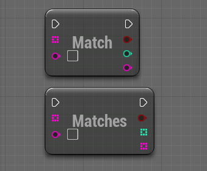

| Node | Inputs | Outputs | Note |
| -------- | ---- | ---- | ---- |
| FilterMatches | Array(String), Pattern | Found, Array(String) | Returns an array containing strings that match the pattern (regex) |
| FilterMatch | Array(String), Pattern | Found, String, Index | Returns the first string matching the pattern (regex) with its index |

 

# Filters by predicate

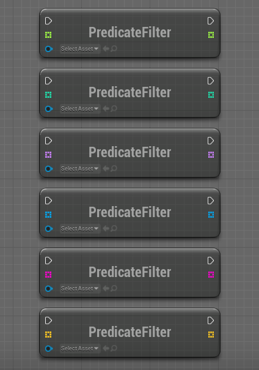

    Note v2: In order to filter by predicate you must create a functions by dragging the PredicateFunction pin and select create event, then create or select a matching function in the list

    Note v1.1 and minor : In order to filter by predicate you must implement the ArrayFilter Interface and pass the object implementing this interface as input of the function (Context), the appropriate filter method will be called to perform the filtering

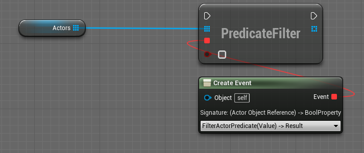
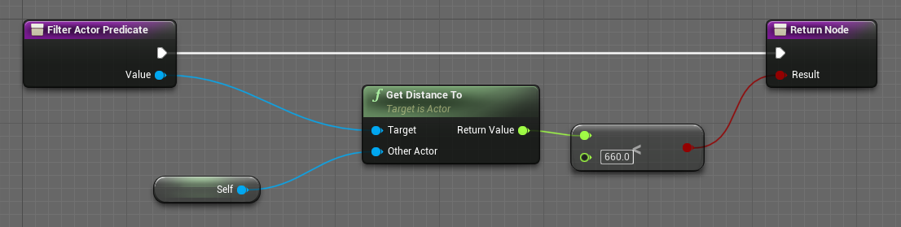

| Node | Inputs | Outputs | Note |
| -------- | ---- | ---- | ---- |
| PredicateFilterInteger | Array(Integer), PredicateFunction, InvertResult | Array(Integer) | Returns a new array filtered using a custom predicate |
| PredicateFilterFloat | Array(Float), PredicateFunction, InvertResult | Array(Float) | Returns a new array filtered using a custom predicate |
| PredicateFilterString | Array(String), PredicateFunction, InvertResult | Array(String) | Returns a new array filtered using a custom predicate |
| PredicateFilterName | Array(Name), PredicateFunction, InvertResult | Array(Name) | Returns a new array filtered using a custom predicate |
| PredicateFilterVector | Array(Vector), PredicateFunction | Array(Vector) | Returns a new array filtered using a custom predicate, InvertResult |
| PredicateFilterObject | Array(Object), PredicateFunction | Array(Object) | Returns a new array filtered using a custom predicate, InvertResult |
| PredicateFilterActor | Array(Actor), PredicateFunction | Array(Actor) | Returns a new array filtered using a custom predicate, InvertResult |

 
 
